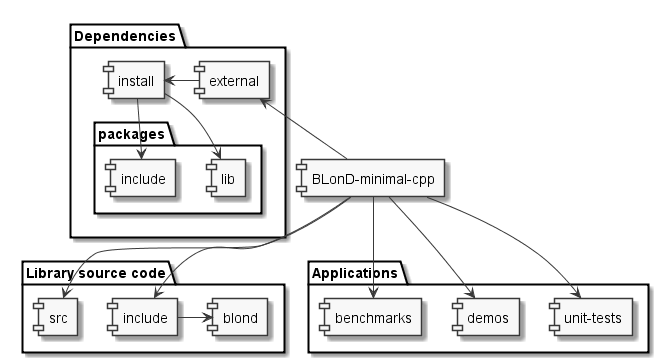

#Project structure
This project consists of a library and a set of demo applications using it.
##Folder structure

###Dependencies
 * Main library depends on OpenMP, OpenCL and FFTW.
 * Tests depend on Google Test libraries
 * Benchmarks depend on Google Benchmark libraries
###Library source code
Library source code is distributed across two folders: 
 * For implementations (`.cpp` files) - `BLonD-minimal-cpp/src` folder
 * For interface files (`.h` files) - `BLonD-minimal-cpp/include` folder
###Applications
There are 3 types of applications:
 1. Unit-Tests (`.cpp` files) located in `BLonD-minimal-cpp/unit-tests` folder
 2. Library Demo applications (`.cpp` files) located in `BLonD-minimal-cpp/demos` folder
 3. Benchmarks (`.cpp` files) located in `BLonD-minimal-cpp/benchmarks` folder
###Build files
Cmake is used to build library and update project structure when new files are added.
 * There is the main build configuration file `BLonD-minimal-cpp/CMakeLists.txt`
 * configuration file for all external libraries `BLonD-minimal-cpp/external/CMakeLists.txt`
   * configuration files for each external library `BLonD-minimal-cpp/external/*.cmake`
 * configuration files that set defines for benchmarks `BLonD-minimal-cpp/benchmark/*.cmake`
####CI
There are two CI files:
 * Linux based CI using TravisCI `BLonD-minimal-cpp/.travis.yml`
 * Windows based CI using AppVeyor `BLonD-minimal-cpp/appveyor.yml`
####Documentation
Documentation consists of 
 1. `*.md` files in `BLonD-minimal-cpp/docs` folder and main `ReadMe.md` and `LICENCE.md` 
 2. `BLonD-minimal-cpp/Doxyfile` that configures source code documentation
 3. `BLonD-minimal-cpp/benchmarks/reports/` folder covering Benchmark results

###Solution file
Depending on CMake arguments solution may contain: 
 1. main library project and demos
 2. unit-tests
 3. benchmarks
 4. clang-format target project
Each application will have its own project.
###Dependencies
If external libraries are build their artifacts will be located in `BLonD-minimal-cpp/external/install`. It will contain
four directories:
 * `bin` with shared objects that shall be copied to applications build folder 
 * `include` that contains includes required to build project
 * `lib` filled with static libraries build artifacts (on windows in Debug and Release subfolders)
 * `share` that contains other external library artifacts not required bu the project